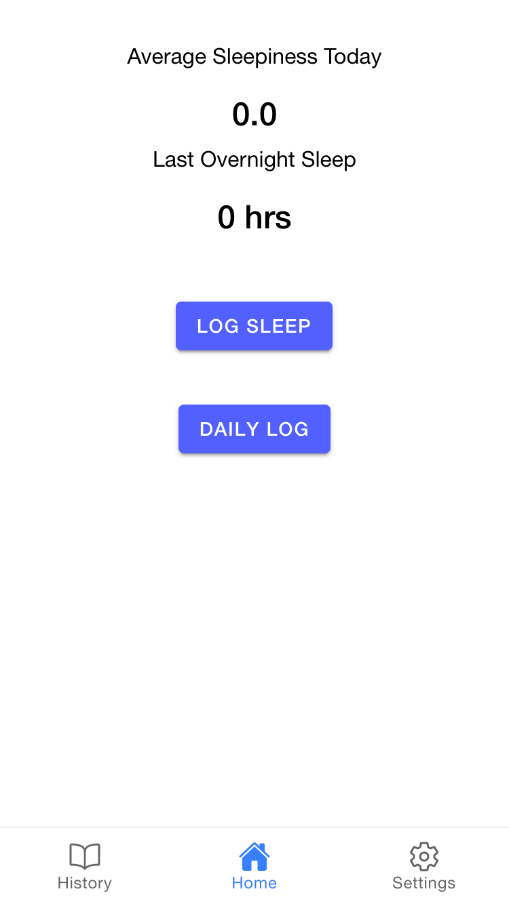
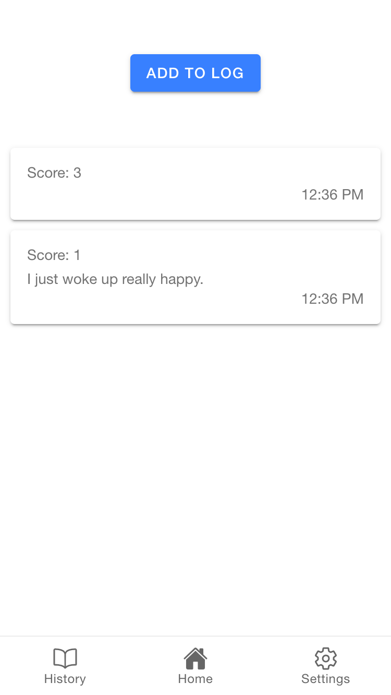
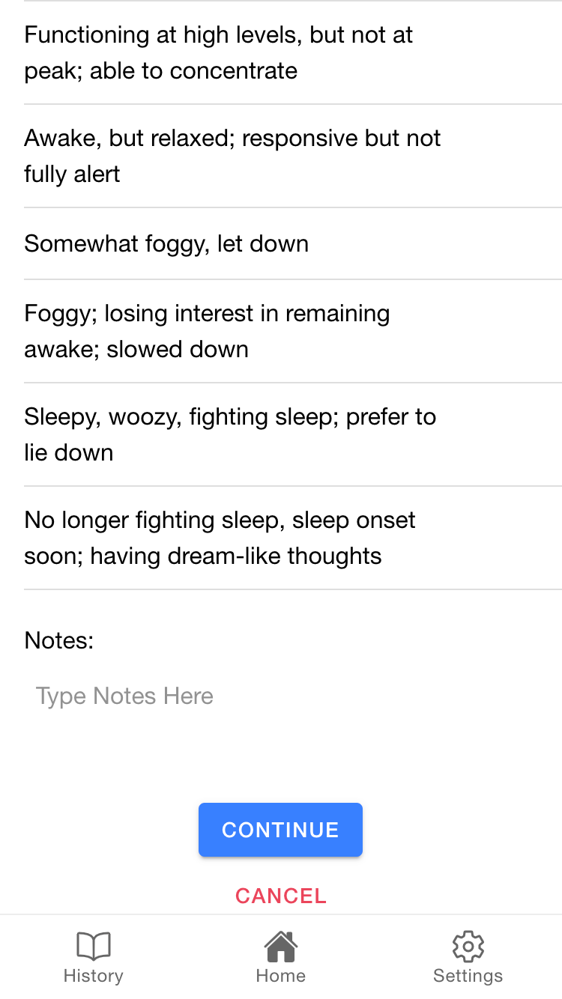
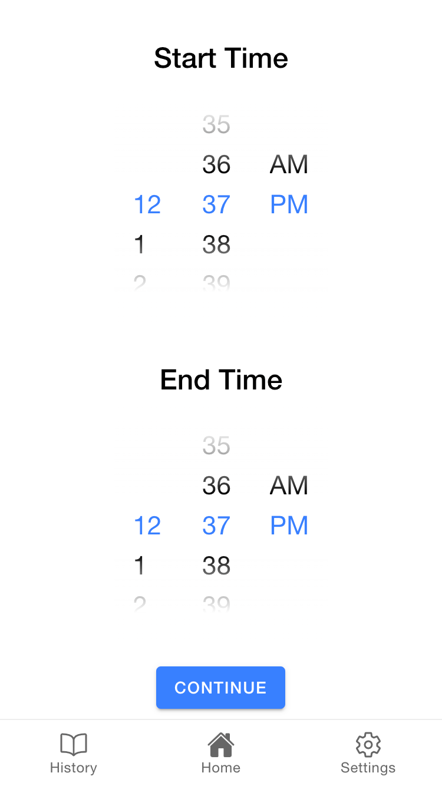
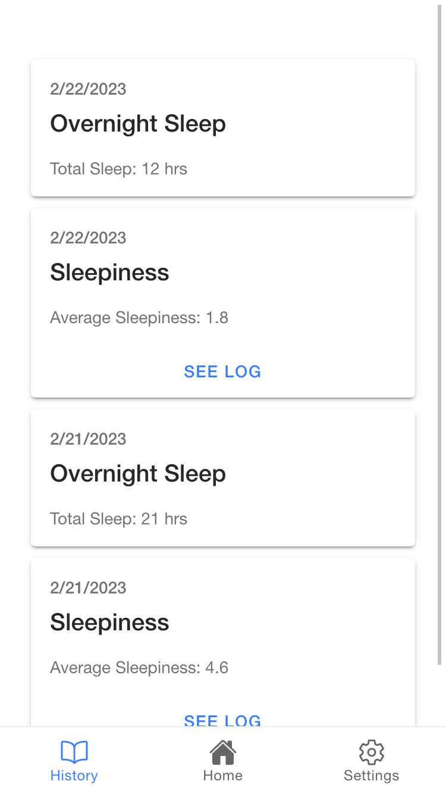
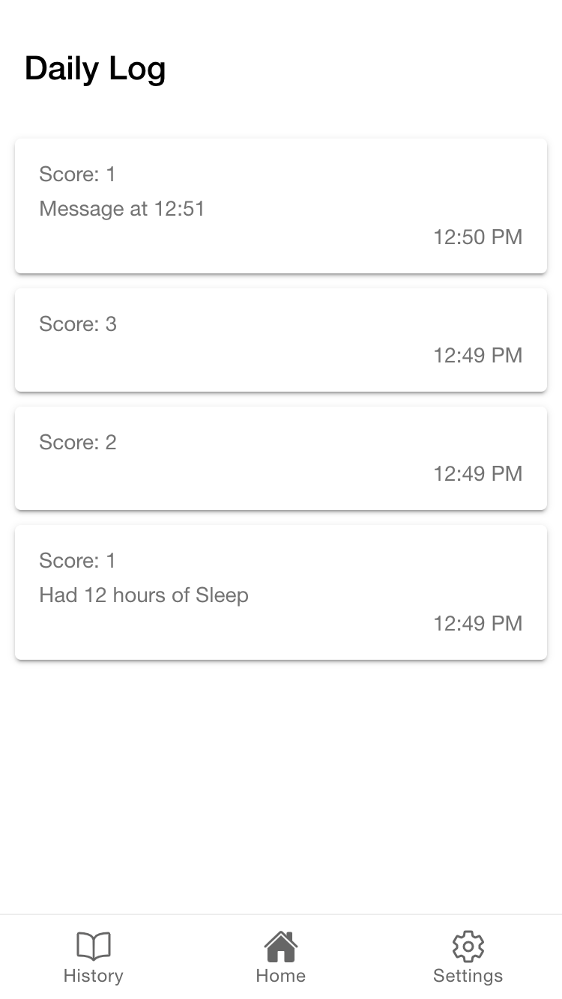

# Sleeptracker  
Ionic/Angular application (web/mobile integration)

## Dependencies  
Ionic and Angular  

### Build

Run `npm install` on terminal to install dependencies.  

### Running  

Run `ng serve` on terminal.  

### Current Views

Home Page

  

Daily Log and Adding to Log

  
  

Logging Sleep

  

History Page and Viewing Sleepiness Log

  
  

